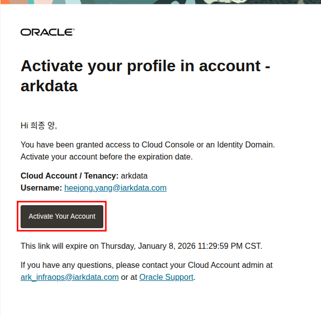
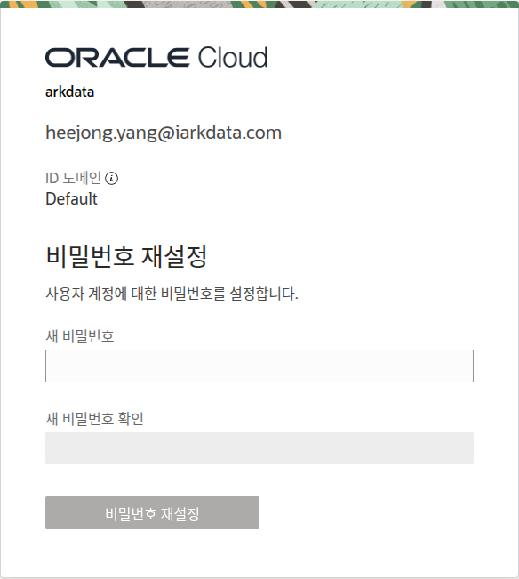
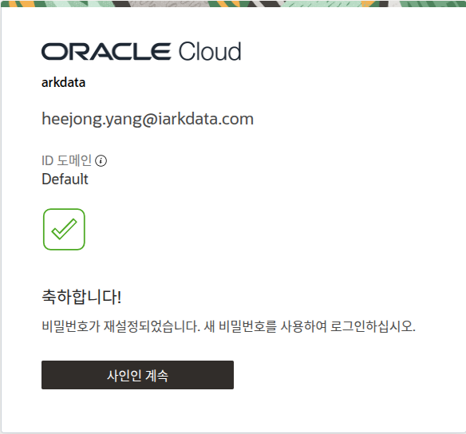
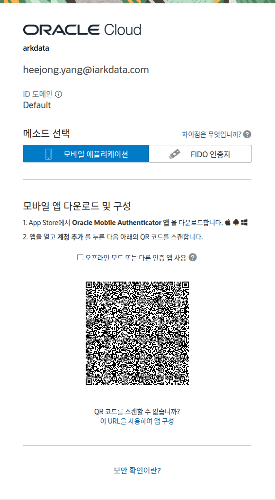
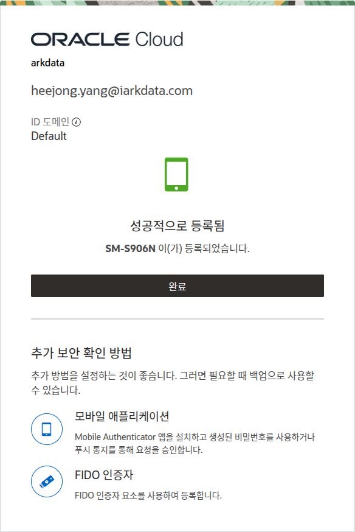

# 사용자 가이드

## OCI 신규 사용자 계정 활성화

OCI 계정 초대를 받은 신규 사용자는 다음 절차에 따라 계정을 활성화하고 MFA(다단계 인증) 설정을 완료해야 합니다.

### 1. 이메일 초대 수락

a.  OCI 관리자로부터 받은 초대 이메일을 엽니다.
b.  이메일 본문에 있는 **Accept Invitation** 버튼을 클릭합니다.

    

### 2. 패스워드 설정

a.  **Accept Invitation** 링크를 클릭하면 패스워드를 설정하는 페이지로 이동합니다.
b.  규칙에 맞는 새로운 패스워드를 입력하고 확인을 위해 한 번 더 입력합니다.
c.  **Create Password** 버튼을 클릭하여 패스워드 설정을 완료합니다.

    

### 3. 클라우드 계정 사인인

a.  패스워드 설정이 완료되면 OCI 로그인 페이지로 이동합니다.
b.  Cloud Account Name (`iarkdata`)이 맞는지 확인하고 **Next**를 클릭합니다.
c.  앞서 설정한 패스워드를 사용하여 로그인합니다.

    

### 4. MFA(다단계 인증) 설정

로그인 후 보안을 위해 MFA(다단계 인증) 설정 페이지로 이동합니다.

a.  **MFA 활성화**
    - 모바일 기기에 Google Authenticator, Microsoft Authenticator 등 OTP 앱을 설치합니다.
    - OTP 앱을 열고 QR 코드를 스캔합니다.

    

b.  **인증 코드 입력**
    - OTP 앱에 표시된 6자리 코드를 OCI 웹페이지의 `Verification Code` 필드에 입력합니다.
    - **Verify** 버튼을 클릭합니다.

    

c.  **설정 완료**
    - 성공적으로 인증되면 MFA 설정이 완료됩니다. 이제 OCI 콘솔에 접근할 수 있습니다.

    
